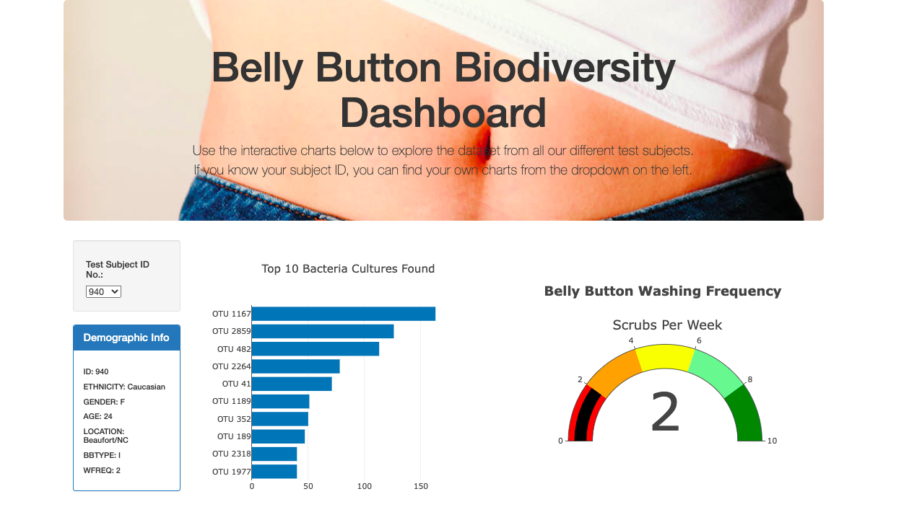
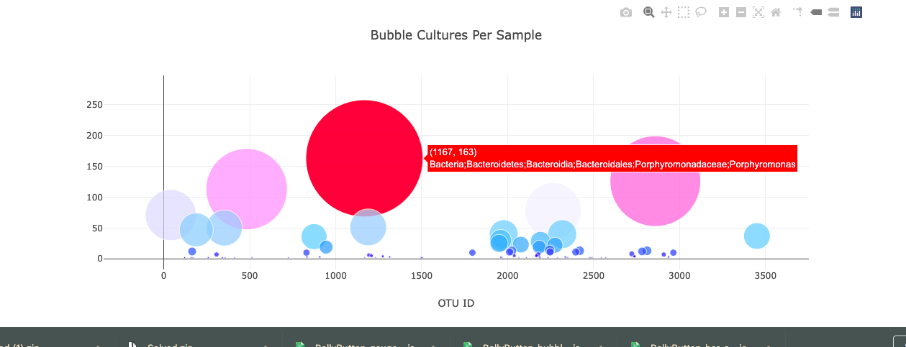

# Plotly Deployment

## Background
Roza is raring to start her project. She knows that she wants to create engaging and dynamic charts. It's her task to identify the best way to share her information with her audience.

Her first step is to master the basics of Plotly. For example, if she can create a basic chart in Plotly, she can build on her knowledge to create more advanced ones. Furthermore, she needs to identify the types of charts she can create with Plotly. Knowing the available options will enable her to select an appropriate visualization type for a dataset.

Throughout her journey, Roza will keep in mind how to best convey data to her volunteers and other researchers. For volunteers who are interested in selling their bacteria to Improbable Beef, what is the best way to visualize the types of bacteria that colonize their bellies? Some of them will be suitable for synthetic beef production, while others will not. Learning to use Plotly will be an important first step.

This will help her decide which type of chart to use when visualizing data of belly button critters. For example, which type of chart might she use if she were to display the top ten most commonly found bacteria in a person's belly button?

Each of her volunteers carries a variety of bacterial species in his or her belly button. There is also information on the number of bacteria found for each species. The dashboard Roza has in mind will display the most common bacterial species, by count, in the navel. If Improbable Beef is looking for people who carry a large number of a certain bacterial species, Roza's volunteers should be able to quickly use the dashboard to figure out whether they are eligible to sell their bacteria to the company. To accomplish this goal, she should sort the most common species of bacteria with sort(), and then display the results on the webpage.

The belly button data exists in JSON format. In order to be able to visualize it with Plotly, she must be able to read the data into her script file. She will use the D3.js library to do this. While D3 is primarily a data visualization library, its d3.json() method will allow Roza to read external JSON files, as well as place calls to external web APIs for data.

Roza is now ready to load the belly button data into her script. First, she needs to download the data file to her computer. She'll then use two things to read the data file: the D3.js library and a local server.

She is also able to perform sophisticated data manipulations under the hood. She can retrieve data from an external JSON file, iterate through objects and retrieve necessary data from them, whether they are object keys or object values. She can also iterate through arrays with methods such as map() and filter().

The missing link between the static visualizations and under-the-hood JavaScript data operations is interactivity. It is interactivity that will enable Roza to generate customizable charts dynamically. In order to make interactive visualizations, she'll first need to create JavaScript event listeners.

She'll now create a dynamic line chart: there will be a dropdown menu in the browser with two options. When an option is selected, the browser will display the graph for the dataset associated with that option.

This skill will help Roza with a major task in her project: to create a dashboard in which her volunteers can select their anonymized ID from a dropdown menu in the browser in order to display information about their belly button critters.

Roza is now ready to consolidate her knowledge in order to build the first part of her dashboard: the demographics panel. A dropdown menu will list the ID numbers of all the volunteers. When a volunteer ID is chosen from the dropdown menu, that person's demographics information, such as location, sex, and age, will be displayed.

Roza has come a long way. She's learned to create attractive charts in Plotly, as well as use JavaScript to make these charts dynamic and customizable. Furthermore, Roza has learned how to filter the belly button dataset and to display information specific to each volunteer.

Roza also knows about cross-origin resource restrictions on browsers, and understands that a server app must give the same web address to the data file as well as the associated HTML, CSS, and JavaScript files.

Once Roza completes the belly button data dashboard, she'll have one major task left: sharing it with the rest of the world.

GitHub offers a free service called GitHub Pages to deploy projects like Roza's—that is, to run code on a GitHub server to make it viewable to the public. Without a server, anyone who wants to view Roza's dashboard would need to download the project files and run a local server, such as Python's HTTP server.

## Overview of Project

Roza has a partially completed dashboard that she needs to finish. She has a completed panel for demographic information and now needs to visualize the bacterial data for each volunteer. Specifically, her volunteers should be able to identify the top 10 bacterial species in their belly buttons. That way, if Improbable Beef identifies a species as a candidate to manufacture synthetic beef, Roza's volunteers will be able to identify whether that species is found in their navel.

### Purpose

Deliverable 1: Create a Horizontal Bar Chart
Deliverable 2: Create a Bubble Chart
Deliverable 3: Create a Gauge Chart
Deliverable 4: Customize the Dashboard

## Analysis And Challenges

## Methodology: Analytics Paradigm

#### 1. Decomposing the Ask

#### 2. Identify the Datasource
data source is samples.json, given by Roza.

* _**id**_: key that identifies the ID number.
* _**otu_ids**_ : roperty is an array of the ID numbers of all the bacteria found in this person's navel. OTU stands for Operational Taxonomic Unit, and here it means species or bacterial type. In this instance, there were 80 bacterial types with distinct ID numbers.
* _**sample_values**_:  array contains the corresponding species name for each bacterial ID number. Some bacterial species have different ID numbers, but are clumped together under the same _**otu_label**_.
*

### 3. Define Strategy & Metrics
**Resource:** Javascript, CSS, HTML, Plotly, JavaScript's Math library, D3.json()

#### 4. Data Retrieval Plan

#### 5. Assemble & Clean the Data

#### 6. Analyse for Trends

#### 7. Acknowledging Limitations

#### 8. Making the Call:
The "Proper" Conclusion is indicated below on [Summary](#summary)

## Analysis

The hosted site is available at: https://suyinwb.github.io/Plotly_Deployment/

>Bar & Gauge Charts

>Bubble Chart

## Summary

## Appendix
